# Arbeitsbuch Rechnernetze

<small>Philip Marti<small>

# Aufgaben

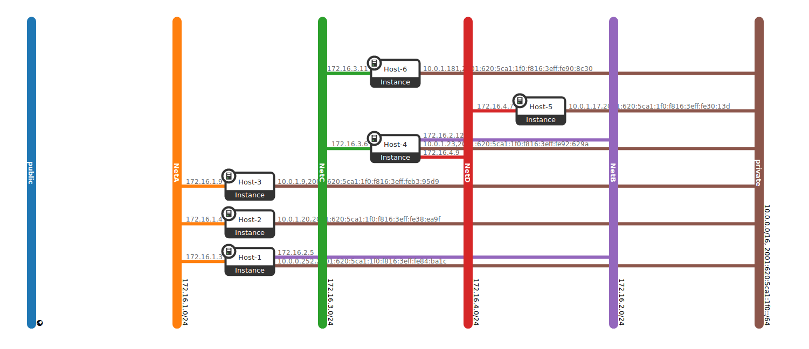

## Arbeitsbuch 3 & 4

### Aufgabe 4

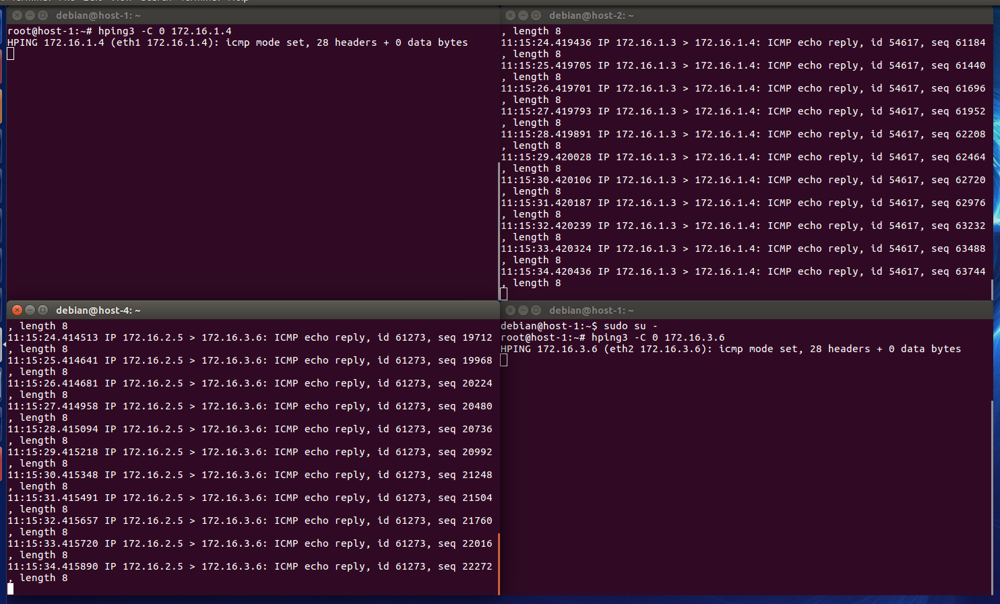  
Sendet man Typ 0 ICMP-Pakete sieht das so aus.  
Auf den beiden Hosts (2 und 4) kommen echo-Pakete an. Für sie sieht es so aus, als hätten sie ein Ping an H1 gesendet und bekommen eine Antwort, obwohl sie nicht danach gefragt haben.  
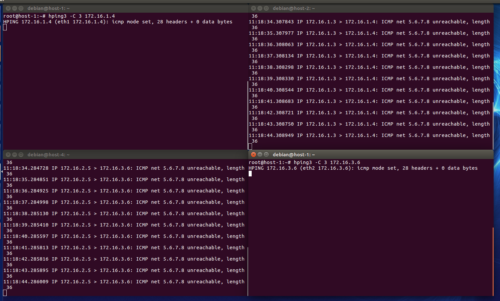  
Werden ICMP-Pakete des Typ 3 versendet, so wird ausgegeben, dass ein Netzwerk nicht erreicht werden konnte. Dies obwohl es eigentlich erreicht werden könnte.  
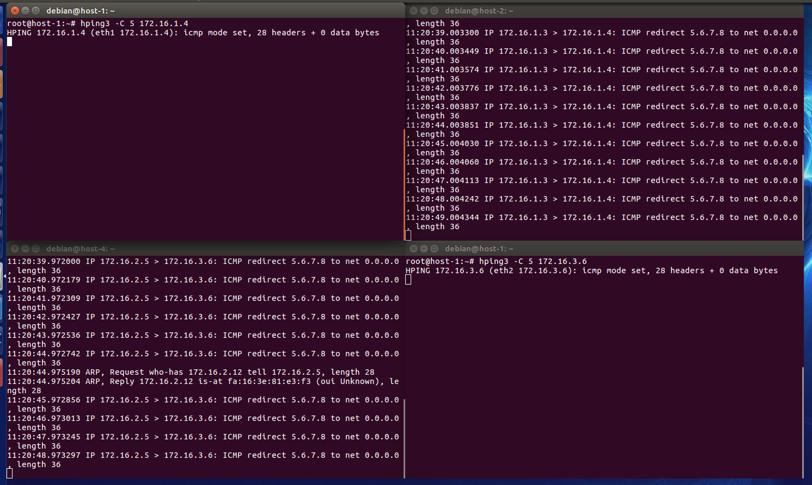  
ICMP-Pakete vom Typ 5 werden an ein anderes Netz umgeleitet (nach 0.0.0.0).  
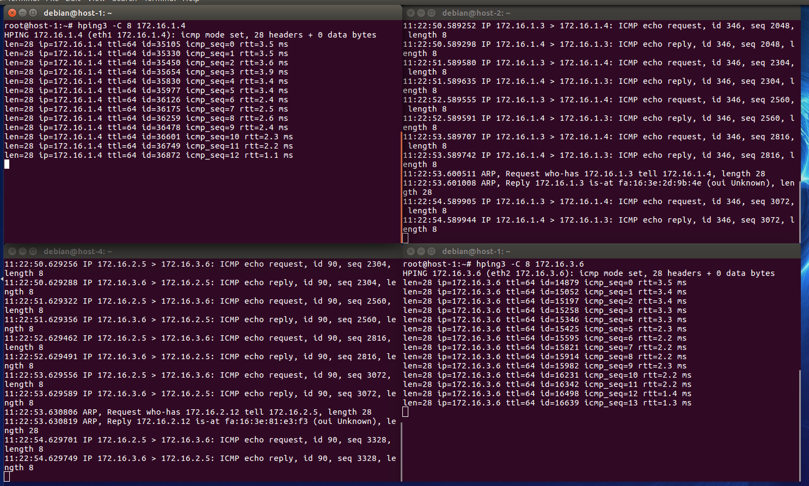  
Mit Typ 8 sieht die Ausgabe so aus. Es ähnelt einem normalen ping, was es im Prinzip auch ist, da ein "echo request" gesendet wird.
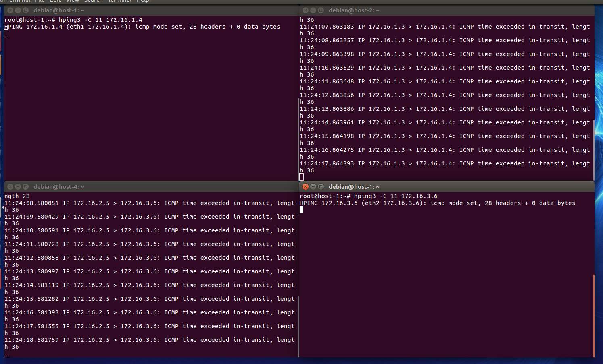  
Mit diesem Typ (Typ 11) wird eine Zeitüberschreitung simuliert.
<a href="https://www.iana.org/assignments/icmp-parameters/icmp-parameters.xhtml">Link zu IANA, Übersicht über die ICMP-Typen</a>

Es kann gefährlich sein, wenn man diesen Befehl benutzt, ohne ihn genau zu kennen. Mit diesem Befehl kann ein anderer Zustand des Netzes simuliert werden, als der tatsächliche Zustand ist (beispielsweise könnte ein Netz erreichbar sein, aber der Befehl sagt etwas anderes aus).  
Ich habe keine Unterschiede zwischen den beiden Maschinen bemerkt. Aus meiner Sicht reagieren also ein Host und ein Router identisch.  
hping3 ist ein sehr mächtiges Netzwerkanalysetool, da man damit auch Hosts hinter einer Firewall erreichen kann. 
<a href="https://www.blackmoreops.com/2015/04/21/denial-of-service-attack-dos-using-hping3-with-spoofed-ip-in-kali-linux/">Die verschiedenen Anwendungszwecke können unter anderem hier nachgeschaut werden.</a> Die Befehle, welche wir verwendet haben, sind aber für ein Netzwerk an sich noch nicht gefährlich und erst mit der Kombination von anderen Befehlen/Tools liesse sich ein Angriff o. Ä. starten. Dennoch würde man ab da von einem Missbrauch reden.

### Aufgabe 5

Beispielnetz:  
0000 1010 0000 1111 0000 0000 0000 0000 (10.15.0.0)  
1111 1111 1111 1111 0000 0000 0000 0000 (255.255.0.0)

Subnetz mit 128 Hosts --> 130 Adressen (256 Adressen)  
10.15.0.0/24  
| Was | Binär | Dezimal |
|--- | --- | --- |
Netzadresse: | 0000 1010 0000 1111 0000 0000 0000 0000 | (10.15.0.0)
Netzmaske: | 1111 1111 1111 1111 1111 1111 0000 0000 | (255.255.255.0)
Broadcast: | 0000 1010 0000 1111 0000 0000 1111 1111 | (10.15.0.255)

Subnetz mit 79 Hosts --> 81 Adressen (128 Adressen)  
10.15.0.0/25  
 Was | Binär | Dezimal
 --- | --- | ---
 Netzadresse:| 0000 1010 0000 1111 0000 0001 0000 0000 | (10.15.1.0)
 Netzmaske:| 1111 1111 1111 1111 1111 1111 1000 0000 | (255.255.255.128)
 Broadcast:|0000 1010 0000 1111 0000 0001 0111 1111| (10.15.1.127)

 Subnetz mit 210 Hosts --> 212 Adressen (256 Adressen)  
 Was | Binär | Dezimal
 ---|---|---|
 Netzadresse:|0000 1010 0000 1111 0000 0010 0000 0000 | (10.15.2.0)
 Netzmaske:|1111 1111 1111 1111 1111 1111 0000 0000| (255.255.255.0)
 Broadcast:|0000 1010 0000 1111 0000 0010 1111 1111| (10.15.2.255)

3 Subnetze mit 317 Hosts --> 319 Adressen (512 Adressen) --> /23  
 **Subnetz 1**
 Was|Binär|Dezimal
 ---|---|---|
 Netzadresse:|0000 1010 0000 1111 0000 0011 0000 0000|(10.15.3.0)
 Netzmaske:|1111 1111 1111 1111 1111 1110 0000 0000|(255.255.254.0)
 Broadcast:|0000 1010 0000 1111 0000 0011 1111 1111|(10.15.3.255)
 **Subnetz 2**
 Was | Binär | Dezimal
 ---|---|---
 Netzadresse:|0000 1010 0000 1111 0000 0101 0000 0000|(10.15.5.0)
 Netzmaske:|1111 1111 1111 1111 1111 1110 0000 0000|(255.255.254.0)
 Broadcast:|0000 1010 0000 1111 0000 0101 1111 1111|(10.15.5.255)
 **Subnetz 3**
 Was|Binär|Dezimal
 ---|---|---
 Netzadresse:|0000 1010 0000 1111 0000 0111 0000 0000|(10.15.7.0)
 Netzmaske:|1111 1111 1111 1111 1111 1110 0000 0000|(255.255.254.0)
 Broadcast:|0000 1010 0000 1111 0000 0111 1111 1111|(10.15.7.255)

 Subnetz mit 64 Hosts --> 66 Adressen (128 Adressen)
 Was| Binär| Dezimal
 ---|---|---
 Netzadresse:|0000 1010 0000 1111 0000 1000 0000 0000|(10.15.8.0)
 Netzmaske:|1111 1111 1111 1111 1111 1111 1000 0000|(255.255.255.128)
 Broadcast:|0000 1010 0000 1111 0000 1000 0111 1111|(10.15.8.127)

 Subnetz mit 33 Hosts --> 35 Adressen (64 Adressen)
 Was|Binär|Dezimal
 ---|---|---
 Netzadresse:|0000 1010 0000 1111 0000 1001 0000 0000|(10.15.9.0)
 Netzmaske:|1111 1111 1111 1111 1111 1111 1100 0000|(255.255.255.192)
 Broadcast:|0000 1010 0000 1111 0000 1001 0011 1111|(10.15.9.63)
 Subnetz mit 224 Hosts --> 226 Adressen (256 Adressen)
 Was|Binär|Dezimal
 ---|---|---
 Netzadresse:|0000 1010 0000 1111 0000 1010 0000 0000|(10.15.10.0)
Netzmaske:|1111 1111 1111 1111 1111 1111 0000 0000|(255.255.255.0)
Broadcast:|0000 1010 0000 1111 0000 1010 1111 1111|(10.15.10.255)
<mark>Nach der PVA 3 würde ich die Aufgabe anders angehen. Ich würde nach dem Ablauf vorgehen, den wir in der PVA angeschaut haben (Biggest first).</mark>
### Aufgabe 6

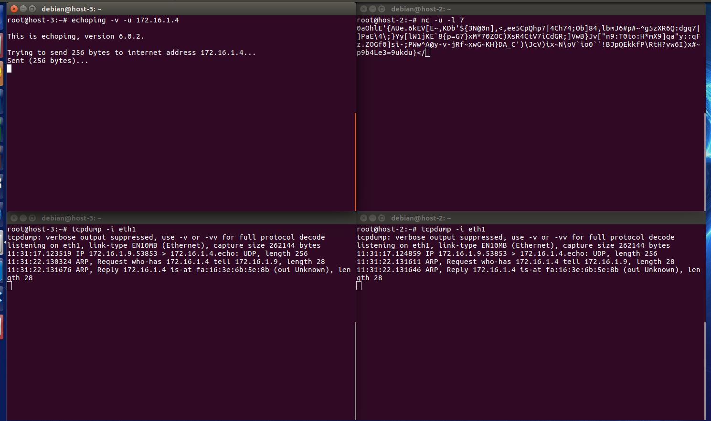  

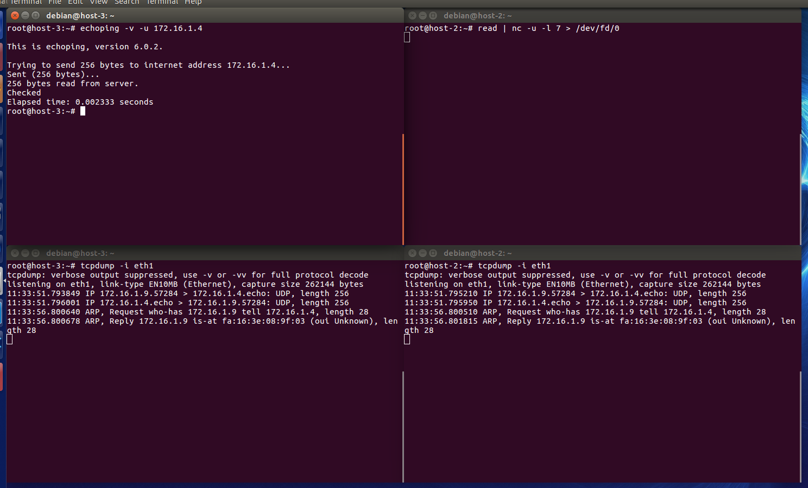  

Es wurde ein Datenpaket übermittelt.
Es wurden insgesamt 262144 Bytes übertragen. Von dem Befehl her wurden aber nur 256 Bytes gesendet.

Aufgrund dieser Informationen vom Befehl her können keine weiteren Informationen ausgelesen werden. Dazu müssten weitere Commands ausgeführt werden.

## Zusatzaufgaben zum Arbeitsbuch 3 & 4
### Aufgabe 1
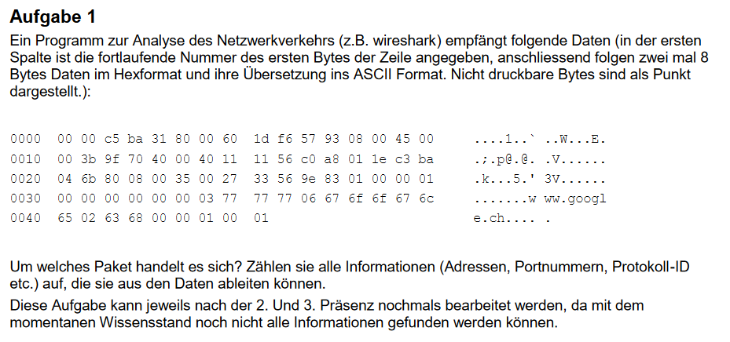
Das abgefangene Paket ist eine DNS-Abfrage auf www.google.ch.  
**Adressen**  
Sender:  
- MAC: 00:60:1d:f6:57:93 (NIC ist von LUCENT TECHNOLOGIES)
- IP: 192.168.1.30  
Empfänger:
- MAC: 00:00:c5:ba:31:80 (NIC ist von ARRIS Group, Inc.)
- IP: 195.186.4.107 (öffentliche IP-Adresse der <a href="https://dig.whois.com.au/ip/195.186.4.107">Swisscom</a>, wahrscheinlich aus <a href="https://www.iplocation.net/">Bern</a>)
Es ist das "Nicht Fragmentieren"-Bit gesetzt. Das Packet hat eine TTL von 64 und es wird UDP verwendet. Beim UDP ist der Source-Port 32776, also ein nicht-reservierter Port und der Destination-Port ist, wie zu erwarten war bei einem DNS-Paket, 53.
Die Transaktions-ID ist: 0x9e83  
Die Abfrage ist eine Standardabfrage, deshalb sind keine speziellen Flags gesetzt.  
Zur Hilfe für die Auswertung der Informationen wurde Wireshark und diverse Online-Nachschlagewerke verwendet.

### Aufgabe 2
Zu dem folgenden Netzwerk sollen die Routingtabellen geschrieben werden.
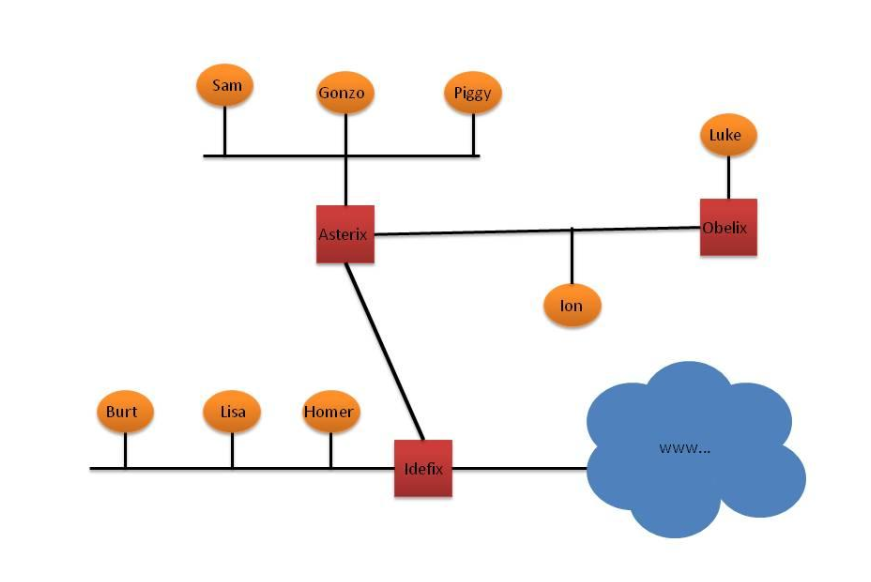

#### Obelix

Zielnetz|Netzmaske|Next Hop|Interface
---|---|---|---
10.0.4.0|255.255.255.0|*|1
10.0.2.0|255.255.255.0|*|0
default|0.0.0.0|10.0.2.1|0

#### Luke

Zielnetz|Netzmaske|Next Hop|Interface
---|---|---|---
10.0.4.0|255.255.255.0|*|0
default|0.0.0.0|10.0.4.1|0

#### Ion

Zielnetz|Netzmaske|Next Hop|Interface
---|---|---|---
10.0.2.0|255.255.255.0|*|0
10.0.4.0|255.255.255.0|10.0.2.2|0
default|0.0.0.0|10.0.2.1|0

#### Asterix

Zielnetz|Netzmaske|Next Hop|Interface
---|---|---|---
10.0.1.0|255.255.255.0|*|0
10.0.2.0|255.255.255.0|*|1
10.0.5.0|255.255.255.0|*|2
10.0.4.0|255.255.255.0|10.0.2.2|1
default|0.0.0.0|10.0.5.2|2

### Sam

Zielnetz|Netzmaske|Next Hop|Interface
---|---|---|---
10.0.1.0|255.255.255.0|*|0
default|0.0.0.0|10.0.1.1|0

#### Gonzo

Zielnetz|Netzmaske|Next Hop|Interface
---|---|---|---
10.0.1.0|255.255.255.0|*|0
default|0.0.0.0|10.0.1.1|0

#### Piggy

Zielnetz|Netzmaske|Next Hop|Interface
---|---|---|---
10.0.1.0|255.255.255.0|*|0
default|0.0.0.0|10.0.1.1|0

#### Idefix

Zielnetz|Netzmaske|Next Hop|Interface
---|---|---|---
Zielnetz|Netzmaske|Next Hop|Interface
---|---|---|---
10.0.3.0|255.255.255.0|*|0
10.0.5.0|255.255.255.0|*|1
10.0.0.0|255.0.0.0|10.0.5.1|1
default|0.0.0.0|*|3

#### Burt
Zielnetz|Netzmaske|Next Hop|Interface
---|---|---|---
10.0.3.0|255.255.255.0|*|0
default|0.0.0.0|10.0.3.1|0

#### Lisa
Zielnetz|Netzmaske|Next Hop|Interface
---|---|---|---
10.0.3.0|255.255.255.0|*|0
default|0.0.0.0|10.0.3.1|0

#### Homer
Zielnetz|Netzmaske|Next Hop|Interface
---|---|---|---
10.0.3.0|255.255.255.0|*|0
default|0.0.0.0|10.0.3.1|0

Ping von Lisa nach Piggy|Lisa zu Idefix|Idefix zu Asterix|Asterix zu Piggy
---|---|---|---
IP-Quelle|10.0.3.22|10.0.3.22|10.0.3.22
IP-Ziel|10.0.1.42|10.0.1.42|10.0.1.42
ARP-Quelle|MAC Lisa|MAC Idefix|MAC Asterix
ARP-Ziel|MAC Idefix|MAC Asterix|MAC Piggy
TTL|128|127|126

### Aufgabe 3

*Welche IP-Adressen sind reserviert? Wofür?*
Reserviert sind alle Netzadressen und Broadcastadressen. Zusätzlich sind noch private Adressbereiche definiert und eine Loopbackadresse reserviert.  
127.0.0.1(Loopback)  
10.0.0.0/8(privater Adressbereich)  
172.16.0.0/16(privater Adressbereich)  
192.168.0.0/16(privater Adressbereich)  
*Was 
passiert, wenn ein Paket an eine Reservierte IP-Adresse (ausserhalb des eigenen Netzes) gesendet wird?*  
Das Paket wird verworfen.  
*Wie funktioniert ARP-Spoofing genau?*  
Als ARP-Spoofing wird das gezielte Manipulieren einer fremden ARP-Tabelle bezeichnet. Eine wirkungsvolle Angriffsform ist die Manipulation der ARP-Tabelle in Kombination mit einer Man-in-the-Middle Attacke. Dabei wird der Angreifer die ARP-Tabellen der Rechner in diesem Subnetz so abändern, dass bei der Router-IP die MAC-Adresse des Angreifers eingetragen wird. Der gesamte Traffic läuft danach über ihn und er kann ihn auslesen und an den Router weitersenden.

### Aufgabe 4
*Auf S.114 ist das Echo Request&Reply Format beschrieben. Normale Pakete (ohne Options) sind danach 8 Bytes gross. Mein Wireshark gibt aber für ein erhaltenes Paket eine Grösse von 64 Bytes an. Weshalb?*

Dies ist der Fall, da nur der ICMP-Header eine Länge von 8 Bytes aufweist. Es wird noch ein Default-Content reingeschrieben, welcher 56 Bytes lang ist.

### Aufgabe 5

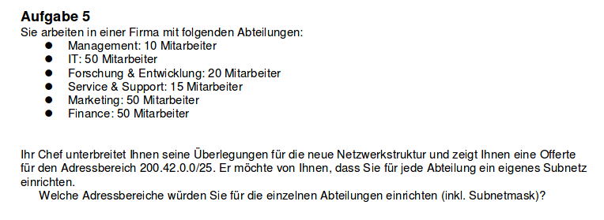
Der Adressbereich ist zu klein. Mit einem Adressbereich der nur 7 Bits umfasst könnten gerade mal zwei Subnetze für 50 Hosts gebildet werden und dann wären schon alle verfügbaren Subnetze ausgeschöpft. Ich würde meinem Chef den Vorschlag machen, einen zusätzlichen Router zu kaufen und diesem eine IP-Adresse aus dem gewünschten Bereich zu geben. So würden Public-IP's gespart werden und die Subnetze könnten in einem privaten Adressbereich gebildet werden. Und für die Umsetzung würde ich ein /23-Netz empfehlen. Ein /24-Netz reicht ganz knapp nicht.

## Arbeitsbuch 5 & 6

### Aufgabe 7

## Ergänzungsaufgaben zu 5 & 6

### Aufgabe 1

Der Three-Way-Handshake läuft folgendermassen ab:

A SYN ------------> B
B SYN, ACK -----------> A
A ACK -----------> B

### Aufgabe 2

a) Das Paket muss vom Router an 10.42.54.12 weitergeleitet werden. Als Source und Destination bleiben die beiden IP-Adressen eingetragen, allerdings ändern die MAC-Adressen.

b) Das ACK-Flag dient zur Bestätigung, dass ein Paket mit einer bestimmten SEQ-Nummer angekommen ist (respektive, dass das Paket mit SEQ+1 erwartet wird).

c) Die TTL bestimmt, über wieviele Router ein Paket gehen darf, da diese Zahl von jedem Router, den es passiert, dekrementiert wird.

d) Die Übertragung sollte beendet werden, da die Windowsize = 0 aussagt, dass das andere Gerät einen vollen Buffer hat. 

### Aufgabe 3

a) Der Sender bemerkt es, wenn er entweder drei DupACK's erhält (Fast Retransmission) oder wenn der Timer abgelaufen ist. Der Timer sollte zuerst genügend hoch gesetzt werden und anschliessend mit Hilfe der RTT neu berechnet werden, damit eine möglichst optimale Performance entsteht.

b) Berechnung muss noch gemacht werden.

### Aufgabe 4

Berechnung muss noch durchgeführt werden.

## Formeln

Eine Formel um zu berechnen, wieviele Pakete benötigt werden, um eine gewisse Anzahl an Daten zu senden.  
Anzahl Pakete = Dateigrösse/(MTU-IPHeader-UDPHeader)

Wie lange dauert die Übertragung einer gewissen Anzahl Pakete über eine Leitung mit vorgegebener Bandbreite?  
Dauer = (Anzahl Pakete + Anzahl Header)/Bandbreite